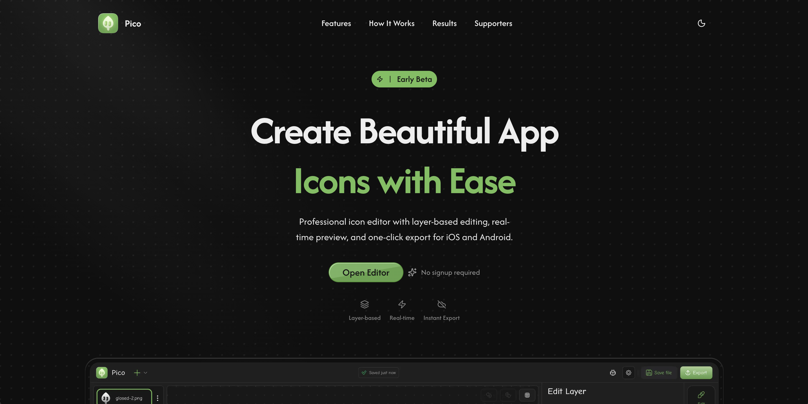

# Pico

Browser-based app icon editor. Compose layers on a canvas, preview iOS squircle and Android circle shapes, and export PNG or JPG at one or many sizes. Early beta; no signup. The editor is desktop-only.

This repo is a single Next.js app. There is no `server/` package and no database.

| Package | Role | Dev URL |
| --- | --- | --- |
| `.` | Next.js App Router UI | `http://localhost:3000` |

## Stack

**Client:** Next.js 16 (App Router), React 19, TypeScript, Tailwind CSS 4, shadcn/ui (radix-nova), Framer Motion, `react-colorful`, Zustand 5 (`immer` + persist → `localStorage` key `pico-editor`), Canvas 2D / JSZip / `file-saver`, `next-themes`. Icons: `lucide-react` in app code; Hugeicons inside shadcn primitives. Package manager: Bun (`bun.lock`).

No backend, API routes, or env vars. Persistence is browser `localStorage` only.

## Layout

```
app/                    Routes: /  /editor  /help  /settings
components/
  editor/               Editor shell, canvas, toolbar panels
  home/                 Landing sections
  navigation/           App sidebar
  shared/               Form fields, theme toggle
  ui/                   shadcn primitives
  modals/               Dialog wrappers
  motion-primitives/    Landing motion helpers
constants/              Sidebar nav items
hooks/                  useIsMobile
lib/
  stores/               useEditorStore
  constants/            Canvas sizes, zoom, shape ratios
  utils/                exportIcon
providers/              ThemeProvider
styles/                 globals.css, landingPage.css
types/                  Layer and canvas types
public/                 Static images
```

Alias: `@/*` → repo root.

```
UI → useEditorStore → localStorage ("pico-editor")
Export runs in the browser (`lib/utils/export.ts`)
```

**Routes (client):** `/` landing, `/editor` canvas + toolbar, `/help` placeholder, `/settings` placeholder.

## Setup

Requires Bun (or npm). No `.env` file.

```sh
bun install
bun run dev
```

Open `http://localhost:3000`. Editor: `/editor`.

## Scripts

**Client:** `dev`, `build`, `start`, `lint`.

Typecheck (no npm script): `bunx tsc --noEmit`.

## Deploy

| Piece | Platform | URL | Account |
| --- | --- | --- | --- |
| Client | Vercel | https://pico-teal.vercel.app/ | main — `itz.me.**********@gmail.com` |
